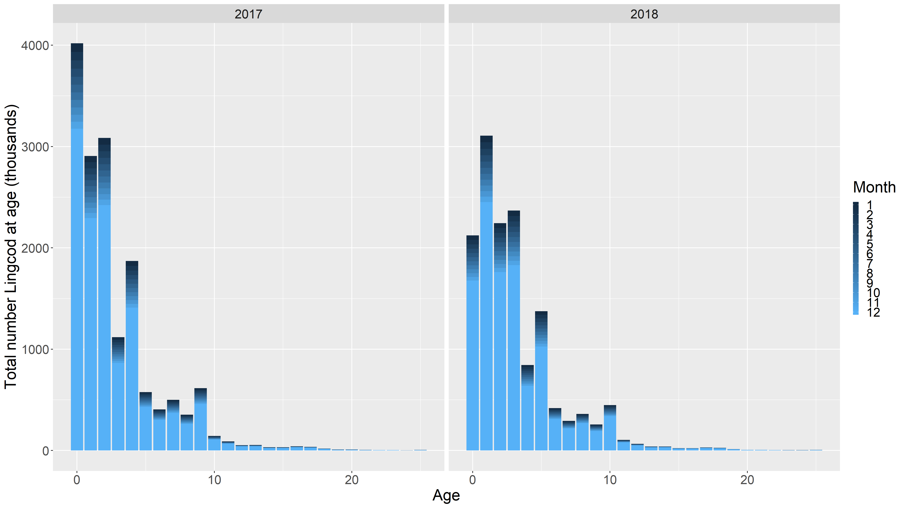
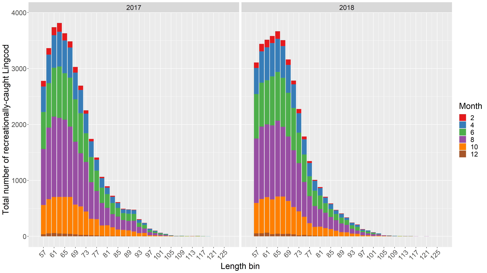

# Example #
    
Run through the wrapper function:

    > library(nwblastarca)

    > firstyear <- 2017
    > forecastyrs <- 2
    > dynamic.stocks <- c('WA.OR.lingcod')
    > MCMC <- 100

    > tsout <- blast_arca_wrapper(MCMC = MCMC, firstyear = firstyear, 
        forecastyrs = forecastyrs, dynamic.stocks = dynamic.stocks)

If you want to run it in parallel you need to register your workers first, for
example:

    > library(doParallel)
    > registerDoParallel(cores = 8)
        
    > tsout <- blast_arca_wrapper(MCMC = MCMC, firstyear = firstyear, 
        forecastyrs = forecastyrs, dynamic.stocks = dynamic.stocks, 
        parallel = TRUE)

Currently outputs numbers at age and recreational catches for the dynamic 
species, and takes about 16 hours for 100 iterations with 8 workers (on an Intel
i7-8700).

We can use the included summary function to plot the results, where you can
save the plots to a chosen directory if desired:
    
    > wd <- "J:/Fishperson/Directory_to_save_plots/"
    > plotout <- Plot_res(tsout, MCMC, wd = wd, savep = TRUE, samplei = TRUE)

    > plotout[[1]]
    > dev.new()
    > plotout[[2]]

